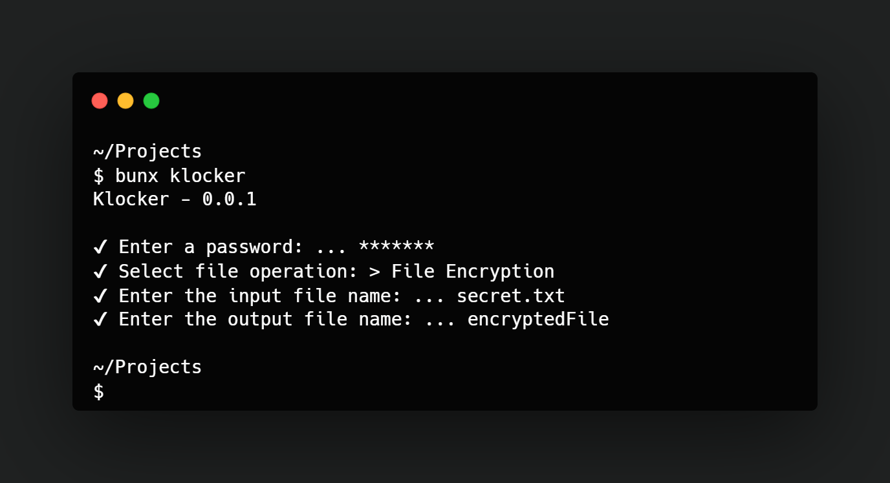

<p align="center">
  <h1 align="center">
    Klocker
  </h1>
  <p align="center">An easy, clean and fast way to encrypt your files via command line.</p>
</p>



## Installation
```bash
# clone https://github.com/kad1rr/klocker
git clone https://github.com/kad1rr/klocker.git

# or just us bunx or npx
bunx klocker
```

## Usage
```bash
# if you cloned the repository
cd klocker
bun klocker.js

# if you just use bunx or npx
bunx klocker
```